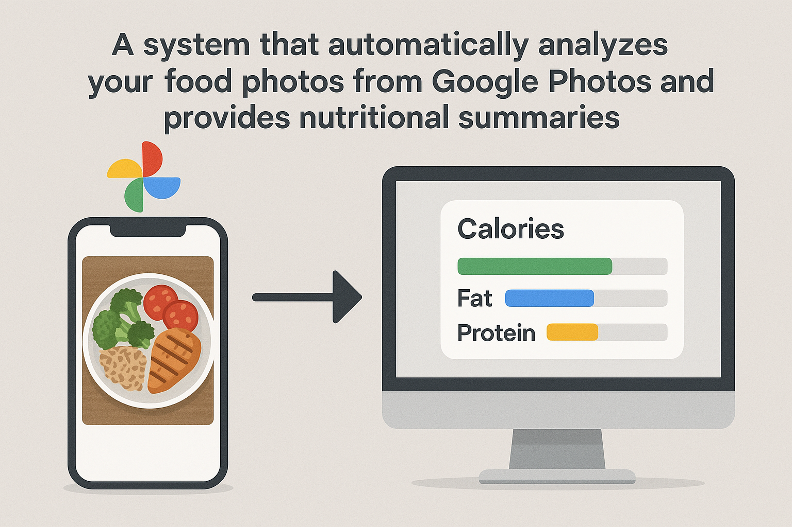

# Food Tracker



A system that automatically analyzes your food photos from Google Photos and provides nutritional summaries.

## Overview

Food Tracker connects to your Google Photos account, retrieves images that contain food, and uses AI vision models to analyze nutritional content. It runs as a scheduled task to give you weekly summaries of your eating habits.

## Features

- **Google Photos Integration**: Automatically retrieves your food photos
- **AI-Powered Analysis**: Uses GPT-4o or Claude to identify food items and estimate nutritional content
- **Scheduled Reports**: Runs as a weekly cron job to track your eating patterns
- **Nutritional Insights**: Provides calories, macronutrients, and vitamin/mineral information
- **Multi-Model Support**: Works with both OpenAI and Anthropic vision models

## Requirements

- Python 3.10+
- Poetry for dependency management
- Google Photos API credentials
- OpenAI API key and/or Anthropic API key

## Setup

1. Clone this repository
2. Install dependencies: `poetry install`
3. Set up Google Photos API:
   - Go to the [Google Cloud Console](https://console.cloud.google.com/)
   - Create a new project (or select an existing one)
   - Navigate to "APIs & Services" > "Library"
   - Search for "Google Photos Library API" and enable it
   - Go to "APIs & Services" > "Credentials"
   - Click "Create Credentials" > "OAuth client ID"
   - Configure the OAuth consent screen:
     - Set User Type to "External"
     - Fill in the required application information
     - Add the scope "https://www.googleapis.com/auth/photoslibrary.readonly"
     - Add your email as a test user
   - Create OAuth client ID:
     - Select "Desktop app" as the application type
     - Name your client
   - Download the JSON file and rename it to `credentials.json`
   - Place the credentials.json file in the project's root directory
4. Configure environment variables in `.env`:

```
OPENAI_API_KEY=your_openai_key
ANTHROPIC_API_KEY=your_anthropic_key
DEFAULT_PROVIDER=openai  # or anthropic
GOOGLE_CREDENTIALS_FILE=credentials.json
```

## Usage

### Set up Google Photos Authentication

```
poetry run python scripts/google_photos_auth.py
```

This will:
1. Open a browser window to authenticate with Google Photos
2. Prompt you to log in and grant the necessary permissions
3. Create a token.pickle file to store your credentials
4. Test the connection by listing your recent photos

If you encounter authentication issues:
- Make sure you've completed all the Google Cloud Console setup steps
- Verify that your credentials.json file is in the project's root directory
- Check that you've added yourself as a test user in the OAuth consent screen
- Ensure the correct scope is enabled (photoslibrary.readonly)

### Download test images (development only)

```
poetry run python scripts/download-test-images.py
```

This will download sample food and non-food images to the test_images directory.

### Run the analyzer manually
There are multiple options for running the analyzer:

##### Basic version
```
poetry run python scripts/food_tracker_poc.py
```

##### Cached version with improved schema validation
```
poetry run python scripts/food_tracker.py
```

##### Asynchronous version for better performance
```
poetry run python scripts/food_tracker_async.py
```

### Configure as cron job
Add to your crontab to run weekly:

```
0 9 * * 1 cd /path/to/food_tracker && poetry run python scripts/food_tracker.py
```

Alternatively, you can use the provided shell script:

Make the script executable

```
chmod +x scripts/run_food_tracker.sh
```

Edit the script to update the path to your project directory
```
nano scripts/run_food_tracker.sh
```
Add to crontab

```
0 9 * * 0 /path/to/food_tracker/scripts/run_food_tracker.sh
```

## Project Structure

- `scripts/food_tracker.py`: Main analysis script (cached version with schema validation)
- `scripts/food_tracker_async.py`: Asynchronous version for improved performance
- `scripts/download-test-images.py`: Utility to download test images
- `scripts/google_photos_auth.py`: Google Photos API authentication script
- `scripts/photo_retriever.py`: Utility to retrieve photos from Google Photos
- `scripts/run_food_tracker.sh`: Shell script for scheduled execution
- `credentials.json`: Google Cloud OAuth credentials (you must create this)
- `token.pickle`: Stored Google Photos authentication token (created automatically)
- `test_images/`: Directory of sample food and non-food images
- `retrieved_photos/`: Directory where photos from Google Photos are saved
- `analysis_results/`: Output JSON and CSV files with analysis results
- `api_cache/`: Cache of API responses to minimize redundant API calls
- `.env`: Environment variables configuration file (you must create this)

## Troubleshooting

### Google Photos Authentication Issues
- **Error: "credentials.json not found"**: Make sure you've downloaded the OAuth credentials from Google Cloud Console and placed them in the project root.
- **Error: "Invalid client secrets file"**: The credentials.json file might be corrupt or have incorrect format. Try re-downloading it.
- **Error: "Access denied"**: Ensure you've added yourself as a test user in the OAuth consent screen.
- **Error: "Insufficient permissions"**: Verify that you've enabled the correct scope (photoslibrary.readonly).

### API Key Issues
- **OpenAI API errors**: Check that your OPENAI_API_KEY is valid and has sufficient quota.
- **Anthropic API errors**: Verify your ANTHROPIC_API_KEY is correct and active.

### Running the Scripts
- If you encounter module import errors, make sure you're running the scripts using Poetry: `poetry run python scripts/script_name.py`
- If the scripts aren't finding photos, check that the paths are correct and that you have permissions to access the directories.

## Development

### Environment Setup
1. Make sure you're using Python 3.10+: `python -V`
2. Install Poetry if you haven't already: [Poetry Installation Guide](https://python-poetry.org/docs/#installation)
3. Set up the virtual environment: `poetry env use python3.10`
4. Install dependencies: `poetry install`

### Code Quality
1. Format code: `poetry run black .`
2. Run tests: `poetry run pytest`
3. Activate the virtual environment for development: `poetry shell`

### Testing the Pipeline
1. Set up Google Photos authentication first: `poetry run python scripts/google_photos_auth.py`
2. Download test images: `poetry run python scripts/download-test-images.py`
3. Run the analyzer in development mode: `poetry run python scripts/food_tracker.py`
4. Check the results in the `analysis_results/` directory

## Next Steps

- [x] Implement Google Photos API authentication
- [x] Build food photo filtering and retrieval from Google Photos
- [x] Implement basic food analysis with vision models
- [ ] Improve food recognition accuracy
- [ ] Add nutritional trends and insights
- [ ] Build weekly summary report generation
- [ ] Add visualization of eating patterns over time
- [ ] Create user dashboard for viewing results
- [ ] Support dietary restrictions and goals
